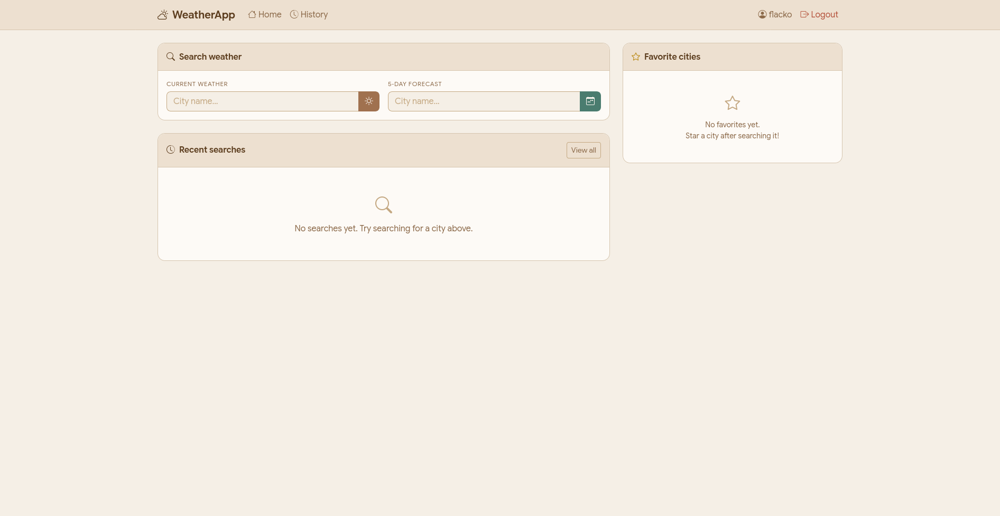
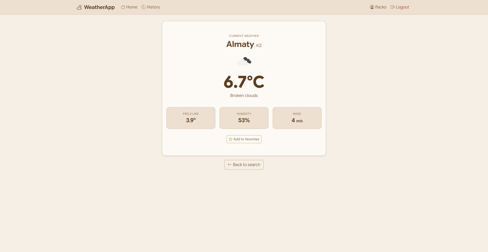
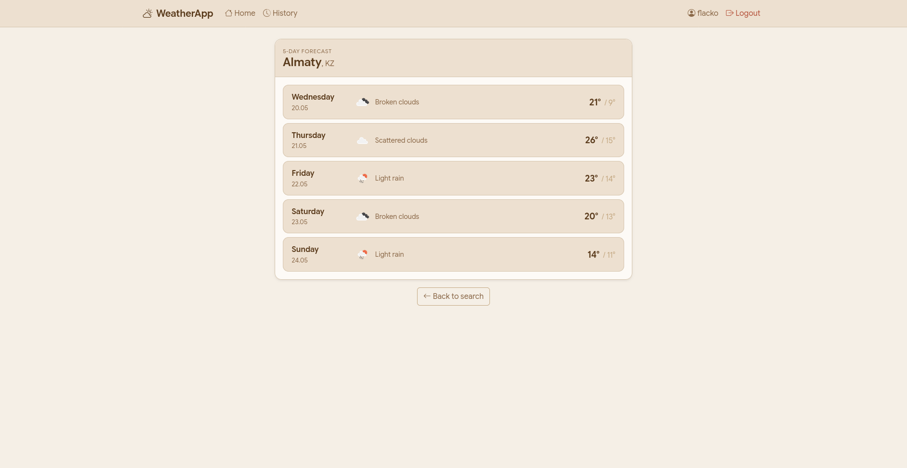
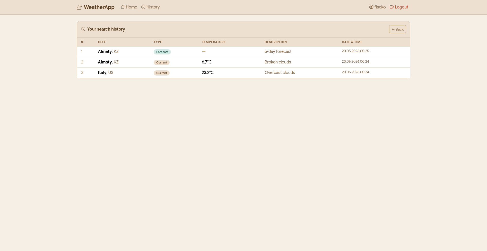
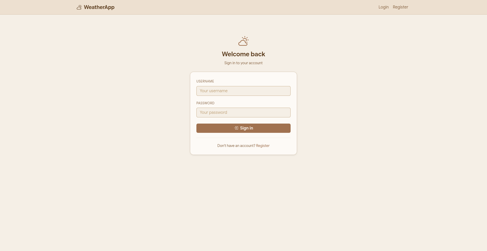

# 🌤️ Weather Project

A full-stack weather web application built with **Django** and powered by the **OpenWeatherMap API**. Check current conditions, browse multi-day forecasts, track your search history, and query weather on the go via a **Telegram bot** — all behind a proper user authentication system.

---

## ✨ Features

- 🔍 **Current Weather** — Real-time conditions for any city (temperature, humidity, wind, description)
- 📅 **5-Day Forecast** — Multi-day outlook with daily breakdowns
- 📜 **Search History** — Per-user history of past weather lookups, stored in the database
- 👤 **User Authentication** — Register, log in, and log out with Django's built-in auth
- 🤖 **Telegram Bot** — Query weather for any city directly from Telegram chat
- 🗄️ **SQLite Database** — Lightweight local storage, zero config required

---

## 📸 Screenshots


| Home | Current Weather | Forecast |
|------|----------------|----------|
|  |  |  |

| History | Login |
|---------|-------|
|  |  |

---

## 🗂️ Project Structure

```
weather_project_stage3/
├── manage.py                  # Django management entry point
├── db.sqlite3                 # SQLite database
├── requirements.txt           # Python dependencies
├── telegram_bot.py            # Telegram bot runner
│
├── weather/                   # Main Django app
│   ├── models.py              # Database models (search history, etc.)
│   ├── views.py               # View logic
│   ├── urls.py                # App-level URL routing
│   ├── forms.py               # Django forms (login, register, search)
│   ├── services.py            # OpenWeatherMap API integration
│   ├── templates/weather/     # HTML templates
│   │   ├── base.html
│   │   ├── index.html
│   │   ├── current.html
│   │   ├── forecast.html
│   │   ├── history.html
│   │   ├── login.html
│   │   └── register.html
│   └── migrations/            # Database migrations
│
└── weather_project/           # Django project config
    ├── settings.py
    ├── urls.py
    └── wsgi.py
```

---

## ⚙️ Setup & Installation

### 1. Clone the repository

```bash
git clone https://github.com/yourusername/weather_project_stage3.git
cd weather_project_stage3
```

### 2. Create a virtual environment

```bash
python -m venv venv
source venv/bin/activate        # macOS/Linux
venv\Scripts\activate           # Windows
```

### 3. Install dependencies

```bash
pip install -r requirements.txt
```

### 4. Configure environment variables

Create a `.env` file in the project root (see [Environment Variables](#-environment-variables) below).

### 5. Apply migrations

```bash
python manage.py migrate
```

### 6. Create a superuser (optional, for Django admin)

```bash
python manage.py createsuperuser
```

### 7. Run the development server

```bash
python manage.py runserver
```

Visit `http://127.0.0.1:8000` in your browser.

### 8. Run the Telegram bot (separate terminal)

```bash
python telegram_bot.py
```

---

## 🔐 Environment Variables

Create a `.env` file in the project root with the following keys:

```env
# Django
SECRET_KEY=your-django-secret-key-here
DEBUG=True

# OpenWeatherMap
OPENWEATHERMAP_API_KEY=your-openweathermap-api-key

# Telegram Bot
TELEGRAM_BOT_TOKEN=your-telegram-bot-token
```


### Getting your API keys

| Service | Where to get it |
|---------|----------------|
| OpenWeatherMap | [openweathermap.org/api](https://openweathermap.org/api) — free tier supports current weather + 5-day forecast |
| Telegram Bot Token | Talk to [@BotFather](https://t.me/BotFather) on Telegram → `/newbot` |
| Django Secret Key | Run `python -c "from django.core.management.utils import get_random_secret_key; print(get_random_secret_key())"` |

---

## 🤖 Telegram Bot Usage

Once the bot is running, open your bot on Telegram and send a city name:

```
You: London
Bot: 🌦 London, GB
     🌡 Temp: 14°C (Feels like 12°C)
     💧 Humidity: 78%
     🌬 Wind: 5.2 m/s
     📋 Light rain
```

Commands:
| Command | Description |
|---------|-------------|
| `/start` | Welcome message and usage instructions |
| `/help` | Show available commands |
| `/weather <city>` or `/forecast <city>` | Get current weather for that city |

---

## 🛠️ Tech Stack

| Layer | Technology |
|-------|-----------|
| Backend | Python 3.14, Django 4.x |
| Database | SQLite (via Django ORM) |
| Weather Data | OpenWeatherMap API |
| Bot | python-telegram-bot |
| Frontend | Django Templates, HTML/CSS |
| Auth | Django built-in authentication |

---

## 📦 Requirements

See `requirements.txt`. Key dependencies:

```
django
requests
python-telegram-bot
python-dotenv
```

---
## 📄 License

This project is for educational purposes. Weather data provided by [OpenWeatherMap](https://openweathermap.org).
